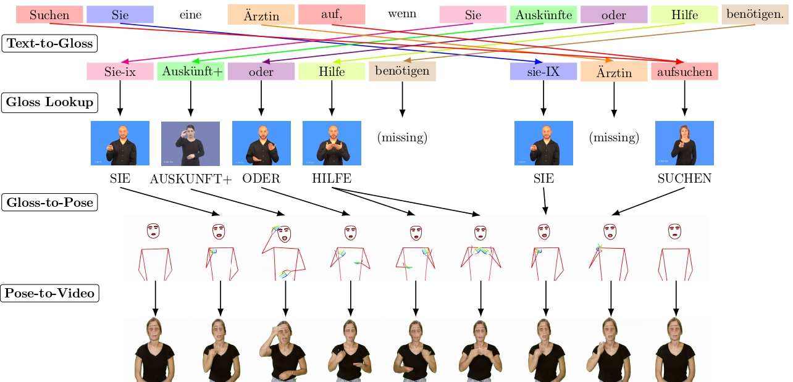

# Gloss-Based Pipeline for Spoken to Signed Language Translation

a `text-to-gloss-to-pose-to-video` pipeline for spoken to signed language translation.

- Demos available for:
  - 🇩🇪 [Swiss German Sign Language](https://sign.mt/?sil=sgg&spl=de) 🇨🇭
  - 🇫🇷 [French Sign Language of Switzerland](https://sign.mt/?sil=ssr&spl=fr)🇨🇭
  - 🇮🇹 [Italian Sign Language of Switzerland](https://sign.mt/?sil=slf&spl=it) 🇨🇭

- Paper available on [arxiv](https://arxiv.org/abs/2305.17714), presented
  at [AT4SSL 2023](https://sites.google.com/tilburguniversity.edu/at4ssl2023/).



## Install

```bash
pip install git+https://github.com/ZurichNLP/spoken-to-signed-translation.git
```

Then, to download a lexicon, run:
```bash
download_lexicon \
  --name <signsuisse> \
  --directory <path_to_directory>
```

## Usage

For language codes, we use the [IANA Language Subtag Registry](https://www.iana.org/assignments/language-subtag-registry/language-subtag-registry).
Our pipeline provides multiple scripts. 

To quickly demo it using a dummy lexicon, run:

<a target="_blank" href="https://colab.research.google.com/drive/1UtBmfBIhUa2EdLMnWJr0hxAOZelQ50_9?usp=sharing">
  
</a>

```bash
git clone https://github.com/ZurichNLP/spoken-to-signed-translation
cd spoken-to-signed-translation

text_to_gloss_to_pose \
  --text "Kleine Kinder essen Pizza in Zürich." \
  --glosser "simple" \
  --lexicon "assets/dummy_lexicon" \
  --spoken-language "de" \
  --signed-language "sgg" \
  --pose "quick_test.pose"
```


#### Text-to-Gloss Translation

This script translates input text into gloss notation. 

```bash
text_to_gloss \
  --text <input_text> \
  --glosser <simple|spacylemma|rules|nmt> \
  --spoken-language <de|fr|it> \
  --signed-language <sgg|ssr|slf>
```

#### Pose-to-Video Conversion

This script converts a pose file into a video file.

```bash
pose_to_video \
  --pose <pose_file_path>.pose \
  --video <output_video_file_path>.mp4
```

#### Text-to-Gloss-to-Pose Translation

This script translates input text into gloss notation, then converts the glosses into a pose file.

```bash
text_to_gloss_to_pose \
  --text <input_text> \
  --glosser <simple|spacylemma|rules|nmt> \
  --lexicon <path_to_directory> \
  --spoken-language <de|fr|it> \
  --signed-language <sgg|ssr|slf> \
  --pose <output_pose_file_path>.pose
```

#### Text-to-Gloss-to-Pose-to-Video Translation

This script translates input text into gloss notation, converts the glosses into a pose file, and then transforms the pose file into a video.

```bash
text_to_gloss_to_pose_to_video \
  --text <input_text> \
  --glosser <simple|spacylemma|rules|nmt> \
  --lexicon <path_to_directory> \
  --spoken-language <de|fr|it> \
  --signed-language <sgg|ssr|slf> \
  --video <output_video_file_path>.mp4
```

## Methodology

The pipeline consists of three main components:

1. **Text-to-Gloss Translation:**
   Transforms the input (spoken language) text into a sequence of glosses.

- [Simple lemmatizer](src/text_to_gloss/simple.py),
- [Spacy lemmatizer: more accurate, but slower lemmatization, covering fewer languages than `simple`](src/text_to_gloss/spacylemma.py),
- [Rule-based word reordering and dropping](src/text_to_gloss/rules.py) component
- [Neural machine translation system](src/text_to_gloss/nmt.py).

2. **Gloss-to-Pose Conversion:**

- [Lookup](src/gloss_to_pose/lookup.py): Uses a lexicon of signed languages to convert the sequence of glosses into a
  sequence of poses.
- [Pose Concatenation](src/gloss_to_pose/concatenate.py): The poses are then cropped, concatenated, and smoothed,
  creating a pose representation for the input sentence.

3. **Pose-to-Video Generation:** Transforms the processed pose video back into a synthesized video using an image
   translation model.

## Supported Languages

| Language                    | IANA Code | Glossers Supported                                                                                                                                         | Lexicon Data Source                                  |
|-----------------------------|-----------|------------------------------------------------------------------------------------------------------------------------------------------------------------|------------------------------------------------------|
| Swiss German Sign Language  | sgg       | `simple`, `spacylemma`, `rules`, [`nmt`](https://github.com/ZurichNLP/spoken-to-signed-translation/tree/main/spoken_to_signed/text_to_gloss#nmt-component) | [SignSuisse (de)](https://signsuisse.sgb-fss.ch/de/) |
| Swiss French Sign Language  | ssr       | `simple`, `spacylemma`                                                                                                                                                   | [SignSuisse (fr)](https://signsuisse.sgb-fss.ch/fr/) |
| Swiss Italian Sign Language | slf       | `simple`, `spacylemma`                                                                                                                                                   | [SignSuisse (it)](https://signsuisse.sgb-fss.ch/it/) |
| German Sign Language        | gsg       | `simple`, `spacylemma`, [`nmt`](https://github.com/ZurichNLP/spoken-to-signed-translation/tree/main/spoken_to_signed/text_to_gloss#nmt-component)                        | WordNet (Coming Soon)                                |
| British Sign Language       | bfi       | `simple`, `spacylemma`, [`nmt`](TODO-model-link)                                                                                                                         | WordNet (Coming Soon)                                |


## Citation

If you find this work useful, please cite our paper:

```bib
@inproceedings{moryossef2023baseline,
  title={An Open-Source Gloss-Based Baseline for Spoken to Signed Language Translation},
  author={Moryossef, Amit and M{\"u}ller, Mathias and G{\"o}hring, Anne and Jiang, Zifan and Goldberg, Yoav and Ebling, Sarah},
  booktitle={2nd International Workshop on Automatic Translation for Signed and Spoken Languages (AT4SSL)},
  year={2023},
  month={June},
  url={https://github.com/ZurichNLP/spoken-to-signed-translation},
  note={Available at: \url{https://arxiv.org/abs/2305.17714}}
}
```
