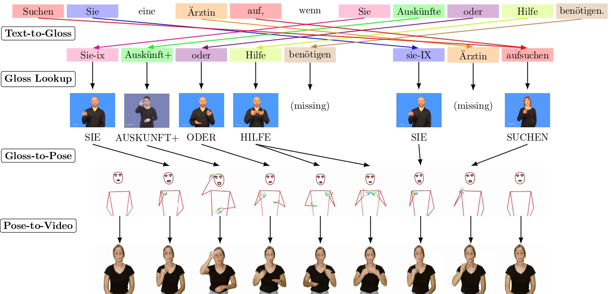

# Gloss-Based Pipeline for Spoken to Signed Language Translation

a `text-to-gloss-to-pose-to-video` pipeline for spoken to signed language translation.

- Demos available for:
  - 🇩🇪 [Swiss German Sign Language](https://sign.mt/?sil=sgg&spl=de) 🇨🇭
  - 🇫🇷 [French Sign Language of Switzerland](https://sign.mt/?sil=ssr&spl=fr)🇨🇭
  - 🇮🇹 [Italian Sign Language of Switzerland](https://sign.mt/?sil=slf&spl=it) 🇨🇭

- Paper available on [arxiv](https://arxiv.org/abs/2305.17714), presented
  at [AT4SSL 2023](https://sites.google.com/tilburguniversity.edu/at4ssl2023/).



## Install

```bash
pip install spoken-to-signed
```

Then, to download a lexicon, run:
```bash
download_lexicon \
  --name <signsuisse> \
  --directory <path_to_directory>
```

## Usage

For language codes, we use the [IANA Language Subtag Registry](https://www.iana.org/assignments/language-subtag-registry/language-subtag-registry).
Our pipeline provides multiple scripts.

To quickly demo it using a dummy lexicon, either open it in Colab:

<a target="_blank" href="https://colab.research.google.com/drive/1UtBmfBIhUa2EdLMnWJr0hxAOZelQ50_9?usp=sharing">
  
</a>

or run it locally with some installation steps first:

```bash
git clone https://github.com/ZurichNLP/spoken-to-signed-translation
cd spoken-to-signed-translation

pip install .

text_to_gloss_to_pose \
  --text "Kleine Kinder essen Pizza in Zürich." \
  --glosser "simple" \
  --lexicon "assets/dummy_lexicon" \
  --spoken-language "de" \
  --signed-language "sgg" \
  --pose "quick_test.pose"
```

#### Text-to-Gloss Translation

This script translates input text into gloss notation.

```bash
text_to_gloss \
  --text <input_text> \
  --glosser <simple|spacylemma|rules|nmt> \
  --spoken-language <de|fr|it> \
  --signed-language <sgg|ssr|slf>
```

#### Text-to-Gloss-to-Pose Translation

This script translates input text into gloss notation, then converts the glosses into a pose file.

```bash
text_to_gloss_to_pose \
  --text <input_text> \
  --glosser <simple|spacylemma|rules|nmt> \
  --lexicon <path_to_directory> \
  --spoken-language <de|fr|it> \
  --signed-language <sgg|ssr|slf> \
  --pose <output_pose_file_path>.pose
```

Words missing from the lexicon are fingerspelled letter-by-letter by default;
pass `--disable-fingerspelling` to skip them instead.

Add `--coverage-info` to print how each token was matched, color-coded in the terminal
(green: lexicon, yellow: language backup, orange: fingerspelling, red: unmatched),
or `--coverage-stats <file.json>` to save the same per-token information as JSON.

#### Text-to-Gloss-to-Pose-to-Video Translation

This script translates input text into gloss notation, converts the glosses into a pose file, and then transforms the pose file into a video.

> **Note:** Video generation requires the `pose-to-video` package with pix2pix and upscaler:
> ```bash
> pip install 'pose-to-video[pix2pix,simple_upscaler] @ git+https://github.com/sign-language-processing/pose-to-video'
> ```

```bash
text_to_gloss_to_pose_to_video \
  --text <input_text> \
  --glosser <simple|spacylemma|rules|nmt> \
  --lexicon <path_to_directory> \
  --spoken-language <de|fr|it> \
  --signed-language <sgg|ssr|slf> \
  --video <output_video_file_path>.mp4
```

## HTTP service

```bash
pip install '.[server]'
MODEL_VERSION=local hypercorn spoken_to_signed.server:app --bind 0.0.0.0:8080
```

`POST /senses-to-gloss` accepts an unmodified WSD document (including dependency
heads and sentence boundaries). English → ASL rules run without an LLM or API key.
Set `WORDNET_URL` to the WordNet API for semantic time-frame ordering.

```json
{
  "spoken_language": "en",
  "signed_language": "ase",
  "senses": {
    "tokens": [
      {"word": "What", "lemma": "what", "pos": "PRON", "dep": "attr", "head": 1},
      {"word": "is", "lemma": "be", "pos": "AUX", "dep": "ROOT", "head": 1},
      {"word": "your", "lemma": "your", "pos": "PRON", "dep": "poss", "head": 3},
      {"word": "name", "lemma": "name", "pos": "NOUN", "dep": "nsubj", "head": 1},
      {"word": "?", "lemma": "?", "pos": "PUNCT", "dep": "punct", "head": 1}
    ],
    "synsets": [],
    "entities": [],
    "sentences": [{"start_token": 0, "end_token": 4}]
  }
}
```

Returns `sentences` in **your name What** order and `indexes: [[2, 3, 0]]`,
plus an auditable `changes` list and `notes` describing conservative fallbacks.
Indexes refer to grouped candidates, not raw tokens. Each candidate carries its
original inclusive `start_token`/`end_token`, exact-span senses/entities, morphology,
and `source` annotations for lookup/fallback. `sentence` and `notes` also travel with
each candidate so flattening does not erase boundaries or limitations.
Unknown words survive for fingerspelling. Standalone punctuation is omitted after
interpreting it; sentence boundaries and question notes are preserved.

Overlapping spans prefer the widest meaning (earlier on ties); constituent senses
are never treated as senses of the whole phrase. No dictionary lookup happens here.
WSD sentence boundaries are authoritative; malformed trees/spans return 422.
Without `WORDNET_URL`, temporal ordering is skipped with a note. Configured WordNet
failures return 503, not a silently different translation. Pin the WordNet deployment
alongside this service for reproducibility. TODO: batch API and batch semantic lookups.
The service checks the pinned OMW resource at startup. Requests are limited to 2 MiB
and 1,024 tokens/annotations. All semantic traversals in a request share a 10-second
budget, checked between lookups; an in-flight lookup has a 5-second socket timeout.
This bounds ordinary slow-service chains, not adversarial slow-drip responses;
WordNet must be a trusted internal service.

The Python entry point is `spoken_to_signed.text_to_gloss.senses.senses_to_gloss`.
Rules produce a **lexical plan, not fluent ASL**: nonmanuals, spatial grammar and
aspect realization remain downstream work. See [rules, evidence and evaluation](evaluation/asl/README.md).
`/tokens-to-gloss` and the HTTP `glosser` selector were removed; existing Python
token/GPT APIs remain available for comparisons. Callers must upgrade their WSD schema.

`POST /gloss-to-pose` accepts already ordered `tokens` and the same language fields,
returning binary `application/pose`. It uses the existing lookup and concatenation,
excluding `pos: "PUNCT"`. Optional: `fingerspelling=true`, `anonymize=false`, `source`
(PostgreSQL video-ID prefix). Configure `LEXICON_PATH` for CSV or `DATABASE_URL`
for PostgreSQL (takes precedence); without either, pose requests return 503.
For PostgreSQL, install `.[server,postgres,gcs]` and use a read-only role.
The optional `SQLPoseLookup` backend migrates the old `models` captions-table lookup
and reads `gs://sign-mt-poses`; it is not dictionary-api synset lookup.
Glosser/health requests need no database. See `/docs` for the full API schema.

```bash
docker build --build-arg MODEL_VERSION=local -t spoken-to-signed .
docker run --rm -p 8080:8080 spoken-to-signed
```

Releases publish `ghcr.io/sign-language-processing/spoken-to-signed-translation:<tag>`.
The image includes PostgreSQL/GCS dependencies. `PORT` defaults to 8080; Hypercorn
supports HTTP/1.1 and HTTP/2 (h2c). Configure HTTP/2 upstream in the gateway too.
`/health` returns `version`; successful API responses include `X-Model-Tag`, set by
`MODEL_VERSION` (baked into release images), with a suffix identifying the configured
WordNet URL or offline mode. Changing WordNet resources at the same URL requires a
new `MODEL_VERSION` to invalidate downstream caches. Deploy internally; auth and caching
belong to the gateway. Caller routing and the old caption-maintenance job still need
migrating before retiring the function in `models`.

## Methodology

The pipeline consists of three main components:

1. **Text-to-Gloss Translation**

   Transforms the input (spoken language) text into a sequence of glosses.

  - [Simple lemmatizer](spoken_to_signed/text_to_gloss/simple.py),
  - [Spacy lemmatizer: more accurate, but slower lemmatization, covering fewer languages than `simple`](spoken_to_signed/text_to_gloss/spacylemma.py),
  - [Rule-based word reordering and dropping](spoken_to_signed/text_to_gloss/rules.py) component and
  - [Neural machine translation system](spoken_to_signed/text_to_gloss/nmt.py).

2. **Gloss-to-Pose Conversion**

  - [Lookup](spoken_to_signed/gloss_to_pose/lookup/lookup.py): Uses a lexicon of signed languages to convert the sequence of glosses into a
      sequence of poses.
  - [Pose Concatenation](spoken_to_signed/gloss_to_pose/concatenate.py): The poses are then cropped, concatenated, and smoothed,
      creating a pose representation for the input sentence.

3. **Pose-to-Video Generation**

    Transforms the processed pose video back into a synthesized video using an image translation model.

## Supported Languages

| Language                    | IANA Code | Glossers Supported                                                                                                                                         | Lexicon Data Source                                  |
|-----------------------------|-----------|------------------------------------------------------------------------------------------------------------------------------------------------------------|------------------------------------------------------|
| Swiss German Sign Language  | sgg       | `simple`, `spacylemma`, `rules`, [`nmt`](https://github.com/ZurichNLP/spoken-to-signed-translation/tree/main/spoken_to_signed/text_to_gloss#nmt-component) | [SignSuisse (de)](https://signsuisse.sgb-fss.ch/de/) |
| Swiss French Sign Language  | ssr       | `simple`, `spacylemma`                                                                                                                                                   | [SignSuisse (fr)](https://signsuisse.sgb-fss.ch/fr/) |
| Swiss Italian Sign Language | slf       | `simple`, `spacylemma`                                                                                                                                                   | [SignSuisse (it)](https://signsuisse.sgb-fss.ch/it/) |
| German Sign Language        | gsg       | `simple`, `spacylemma`, [`nmt`](https://github.com/ZurichNLP/spoken-to-signed-translation/tree/main/spoken_to_signed/text_to_gloss#nmt-component)                        | WordNet (Coming Soon)                                |
| British Sign Language       | bfi       | `simple`, `spacylemma`, [`nmt`](TODO-model-link)                                                                                                                         | WordNet (Coming Soon)                                |

## Online Playgrounds

We have two available:

- [sign.mt](https://sign.mt) is a web interface of a translation system.
- [research.sign.mt](https://research.sign.mt) is an overview of sign language processing literature.

## Citation

If you find this work useful, please cite our paper:

```bib
@inproceedings{moryossef2023baseline,
  title={An Open-Source Gloss-Based Baseline for Spoken to Signed Language Translation},
  author={Moryossef, Amit and M{\"u}ller, Mathias and G{\"o}hring, Anne and Jiang, Zifan and Goldberg, Yoav and Ebling, Sarah},
  booktitle={2nd International Workshop on Automatic Translation for Signed and Spoken Languages (AT4SSL)},
  year={2023},
  month={June},
  url={https://github.com/ZurichNLP/spoken-to-signed-translation},
  note={Available at: \url{https://arxiv.org/abs/2305.17714}}
}
```
